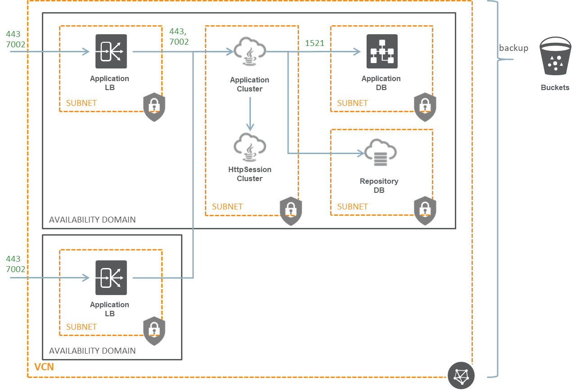
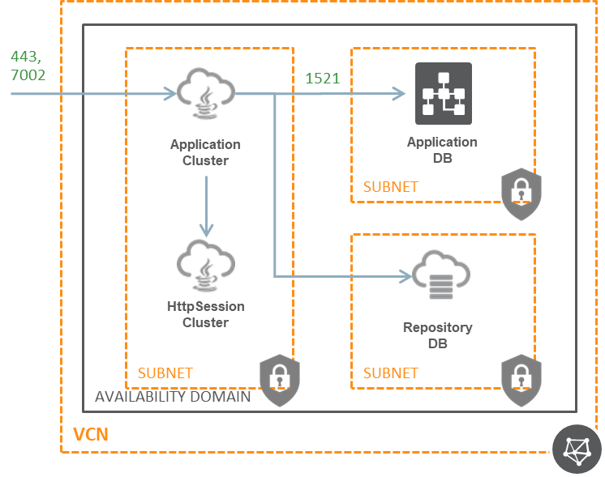

# Rapid Build Tool
本ツールはエンタープライズで使われるミドルウェアの環境をクラウド上へ自動構築するツールです。  

エンタープライズで使われるミドルウェアを使うためには、環境が使えるようになるまで構築に膨大な時間がかかるほか、開発用途などでちょっと使うだけで莫大なライセンス料がかかります。
本ツールを使うと、しばらく待つだけで環境が構築でき不要になったらすぐに環境が削除できる上、システム全体で100～200円程度からさわり始めることができます。

本ツールはまだまだ機能としては不足しているため今後もメンテナンスしていきます。
まずは、本ツールを実際の要件に合わせてカスタマイズして使用してください。

# どんな構成が組めるの？
Load Balancer、Application Server、Http Session Cluster、Relational Databaseの構成を簡単に組めます。
また、アプリケーションや管理ツールへのアクセス方法、バックアップの有無など構成も変更できます。

以下の構成パターン2通りを含む様々な構成が実現できます。構成の指定については後述するパラメータによって指定します。

### 構成パターン　その1
LB経由でアプリケーションと管理ツールへアクセスし、システムのバックアップをオブジェクトストレージに取得する

### 構成パターン　その2
アプリケーションと管理ツールへのアクセスはアプリケーションサーバが直接受け付け、システムのバックアップは取らない

# 使うまで大変なんでしょ？
使うまでの手順は以下の通りです

 - ユーザを作成
 - プライベートキーファイルとフィンガープリントを作成
 - Auth Tokenを作成 (必要に応じて)
 - 構成したいシステムのパラメータを指定（ほとんどはデフォルト値でOK）
 
## ユーザを作成

こちらを参照してください

https://docs.oracle.com/cd/E97706_01/Content/GSG/Tasks/addingusers.htm

## プライベートキーとフィンガープリントを作成

こちらを参照してください。

https://community.oracle.com/docs/DOC-1019624

## Auth Token
デフォルトでは作成した環境ごとに作成されます。ひとつのAuth Tokenを使いまわす場合には後述するパラメータで指定します。

Auth Tokenを使いまわす場合はこちらを参考に作成してください

https://docs.oracle.com/cd/E97706_01/Content/Registry/Tasks/registrygettingauthtoken.htm
 
# パラメータについて
パラメータは大きく分けると以下があります。
 
 - オラクルクラウドのパラメータ (oraclecloud)
 - オラクルのライセンスのパラメータ (has_cloud_license)
 - 構築する環境全体のパラメータ (env)
 - バックアップのパラメータ (backup)
 - アプリケーションのパラメータ (app)
 - アプリケーションサーバのパラメータ (app_server)
 - アプリケーションが使用するデータベースのパラメータ (app_db)
 - ロードバランサのパラメータ (lb)
 - APPサーバが使用するリポジトリDBのパラメータ (repodb)

デフォルトでは、以下の構成で作成されます。
 - Load Balancer
 - APサーバがSEライセンスで1インスタンス
 - HTTP Sessionクラスタは無し
 - アプリケーションが使用するデータベースがSEライセンスで1台
 - リポジトリデータベースがSEライセンスで1台
 
※最小構成となるDBは今後集約する予定です。

パラメータには必須で設定する項目がいくつかあります。

### オラクルクラウドのパラメータ (oraclecloud)
本ツールは Terraform の以下 2 つのプロバイダを使用しており、ここではこれらのプロバイダの設定をします。
 - Oracle Cloud Platform Provider (https://www.terraform.io/docs/providers/oraclepaas/index.html)
 - Oracle Cloud Infrastructure Provider (https://www.terraform.io/docs/providers/oci/index.html)
 
以下のパラメータはすべて必須です。
#####tenancy_ocid
テナンシーのOCIDを指定します。

OCI メニューの Administration の Tenancy Details を開き、Tenancy Information の下にあるテナントの OCID をコピーします。

例：ocid1.tenancy.oc1..xxxxxxxxxxxxxxxxxxxxxxxxxxxxxxxxxxxxxxxxxxxxxxxxxxxxxxxxxxxx
##### identity_domain

例：idcs-xxxxxxxxxxxxxxxxxxxxxxxxxxxxxxxx

##### user
ユーザーの電子メールアドレスを指定します。

例：xxxxx@oracle.com

##### user_ocid
環境を構築するユーザの OCID を指定します。

Identity の Users の中から環境を構築するユーザの OCID をコピーします。

例：ocid1.user.oc1..xxxxxxxxxxxxxxxxxxxxxxxxxxxxxxxxxxxxxxxxxxxxxxxxxxxxxxxxxxxx
##### password

パスワード
##### fingerprint
上記で取得したフィンガープリントを指定します。

例： xx:xx:xx:xx:xx:xx:xx:xx:xx:xx:xx:xx:xx:xx:xx:xx

##### private_key_path
上記で作成したプライベートキーファイルのパスを指定します。

例： /home/opc/.oci/oci_api_key.pem

### 構築する環境全体のパラメータ (env)
構築する環境全体にかかわる設定をします。

必須項目は以下の 3 つです。

 - primary_compartment_ocid
 - ssh_public_key
 - domain_name

##### primary_compartment_ocid
システムを構築するコンパートメントの OCID を指定します。
 
例： ocid1.compartment.oc1..xxxxxxxxxxxxxxxxxxxxxxxxxxxxxxxxxxxxxxxxxxxxxxxxxxxxxxxxxxxx

##### ssh_public_key
作成されるインスタンスで使用する SSH の公開鍵を指定します。ファイルパスではなく OpenSSH の公開鍵を指定してください。
今後 null_resource を使用した自動構築を検討しています。null_resourceはパスフレーズありの鍵を使えないため、鍵はパスフレーズなしを推奨します。

例：ssh-rsa xxxxxxxxxxxxxxxxxxxxxxxxxxxx略xxxxxxxxxxxxxxxx= Test

##### domain_name
ドメイン名を指定します。

例：oracle.com

# 注意
本ツールはOracle Corporationや日本オラクルがサポートする製品ではありません。

使用者は自己の責任において本ツールを利用するものとし、本ツールの利用に関係または関連して生じた一切の行為もしくはその結果について、その責任を負うものとします。
### 既存バグ
バックアップを自動的に消せないため、バックアップを有効化した環境の削除時にOCI CLIの`oci os object bulk-delete -bn <backupのbucket_nameに指定したバケット名> -ns <backupのnamespaceに指定した> --force`を実行して消してください